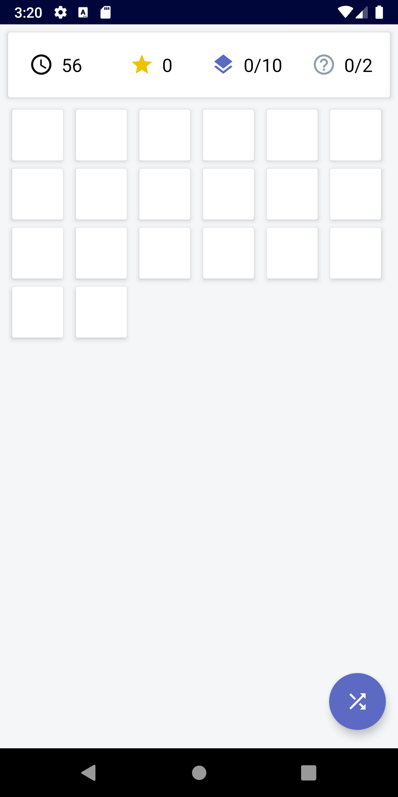
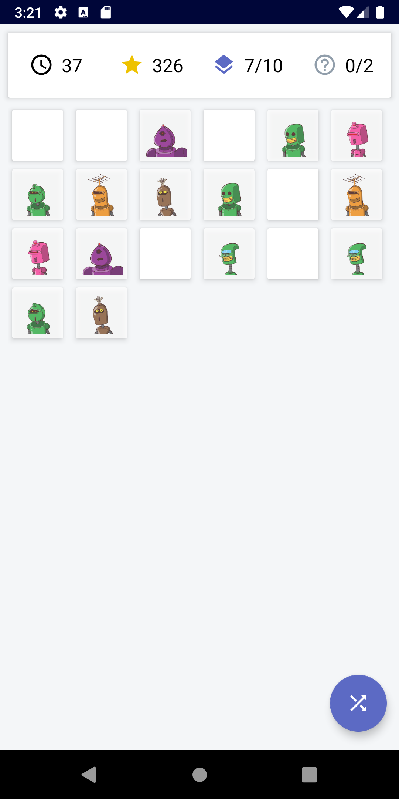
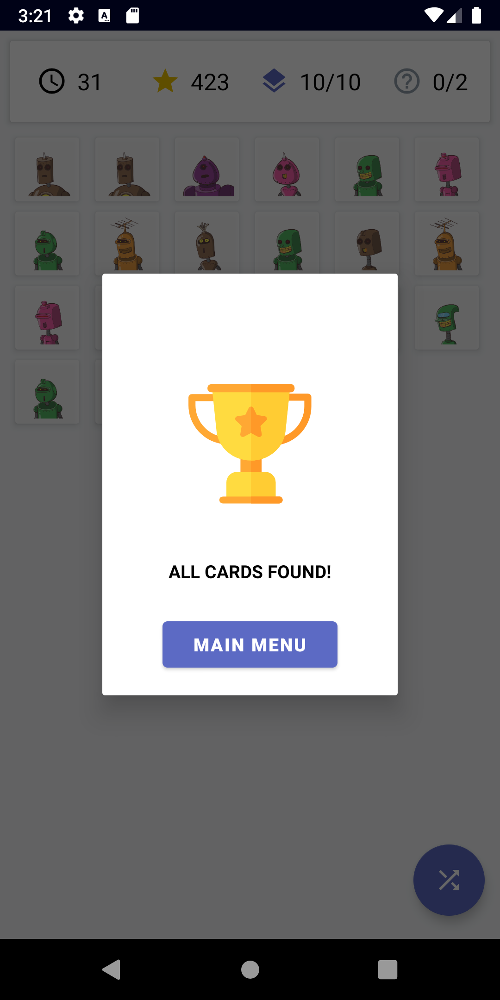
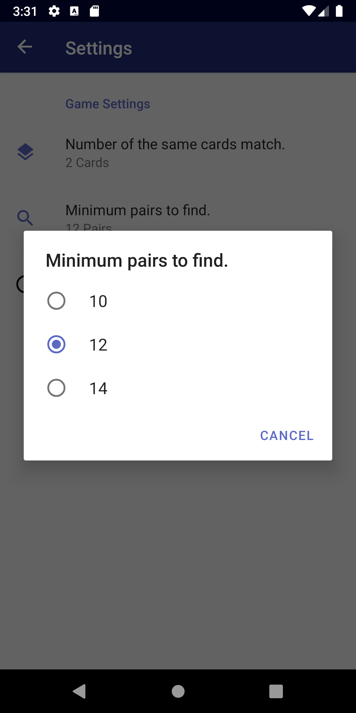
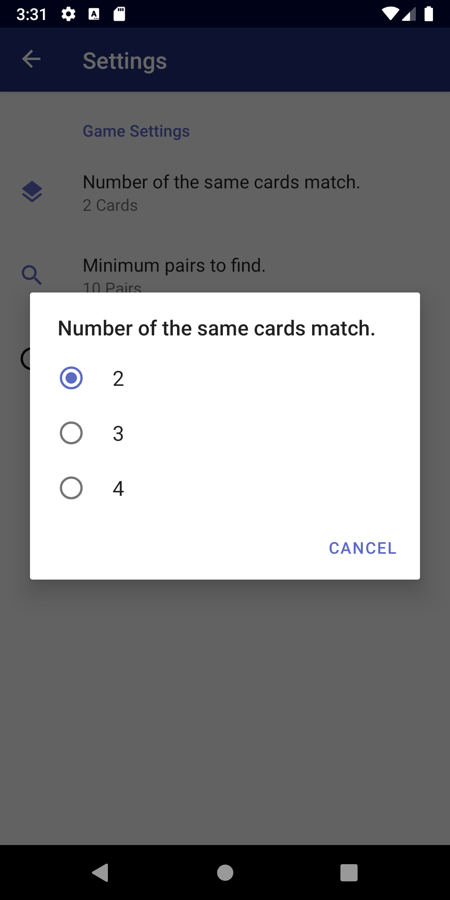
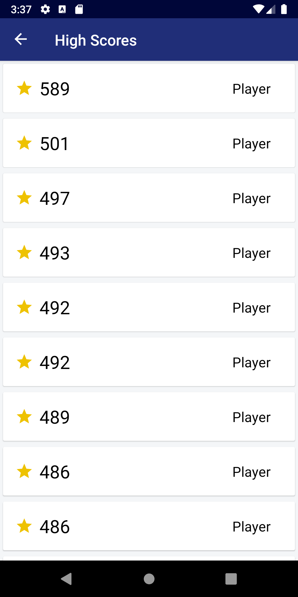
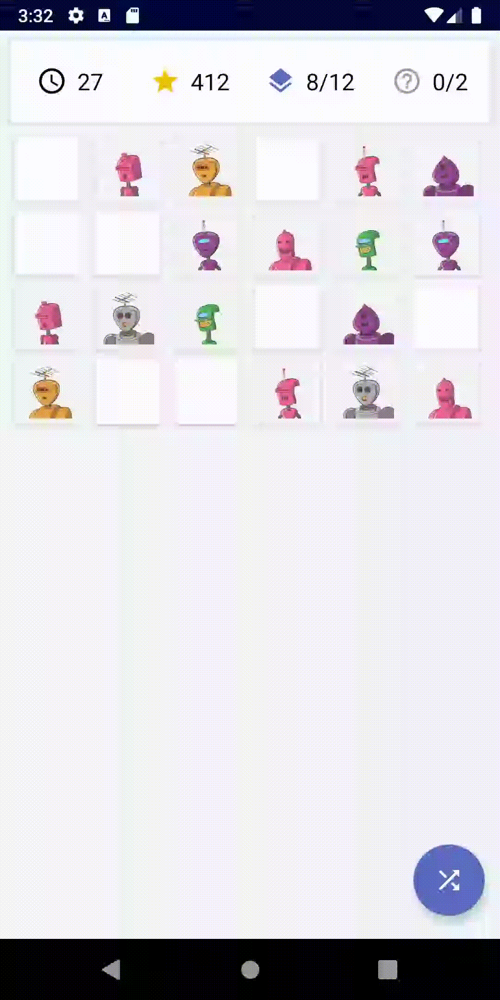

# :rocket: Memory Match

A memory matching mobile app for Android for the position: Mobile Developer Intern (Android) - Winter 2020

  

## What I tried to showcase in this challenge

> Again this isn't a no for forever, I'd love to see you apply again in the near future.

### Growth from my [previous challange](https://github.com/joshvocal/WordSearch)

Some feedback from my previous challenge:

* Learn Kotlin for Android Development
* Study Design Pattern

For this challenge, I used Kotlin instead of Java for development. Learning the language coming from Java was an easy transition.
Using Kotlin, I was able to write less code that was less verbose and safer.

For my last challenge, I used MVC. I found that Google recommends using [MVVM and Jetpack](https://developer.android.com/jetpack/docs/guide) for architecture.
This allowed me to prevent writing most of my code within an Activity or Fragment.

### Jetpack

Looked into [Jetpack](https://developer.android.com/jetpack) and tried using the components that would help me.

* Data Binding
* Live Data
* Navigation
* Room
* Preferences
* ViewModel
* Layout
* Fragment

### Look and Feel

When trying to decide a UI, I looked into the [Shopify Design Guide](https://polaris.shopify.com/patterns-and-guides/shopify-experience-values) to try and give my appliation a similar feel.

* Tried following the guidelines for the Color Palette
* Tried following the guidelines for Icon

> We want people to feel like they can accomplish whatever they’re trying to do. Our experiences should give people confidence that they’re capable of achieving their goals, no matter their level of experience.

* Tried making winning the game empowering with the trophy animation

## Screenshots

|               No Matches               |               Some Matches               |               Win               |
| :------------------------------------: | :--------------------------------------: | :-----------------------------: |
|  |  |  |

## Requirements

| Requirement                                                | Complete |
| ---------------------------------------------------------- | :------: |
| The user should have to find a minimum of 10 pairs to win. |  :bear:  |
| Keep track of how many pairs the user has found.           |  :bear:  |
| When the user wins, display a message to let them know!    |  :bear:  |
| Make sure it compiles successfully.                        |  :bear:  |

## Bonuses!

| Bonus                                                                                               | Complete |                   Image                    |
| --------------------------------------------------------------------------------------------------- | :------: | :----------------------------------------: |
| Make the game configurable to match 3 or 4 of the same products instead of 2.                       |  :bear:  |  |
| Make the grid size configurable. (The player needs to match more than 10 sets of the same product). |  :bear:  |   |
| Build a slick screen that keeps track of the user’s score.                                          |  :bear:  |     |
| Make a button that shuffles the game.                                                               |  :bear:  |         |
| Feel free to make the app beautiful and add anything else you think would be cool!                  |  :bear:  |                                            |

## Libraries

### Jetpack

| Library      | Use                                                                           |
| ------------ | ----------------------------------------------------------------------------- |
| Data Binding | For accessing XML layouts without findViewById()                              |
| Live Data    | For observing changes in Fragments                                            |
| Navigation   | For transitioning to home, game, highscores and settings fragments            |
| Room         | For storing Shopify products into the database                                |
| Preferences  | For changing the minimum pairs to win and configure how many cards is a match |
| ViewModel    | For MVVM architecture                                                         |

### Third Party

| Library    | Use                                                          |
| ---------- | ------------------------------------------------------------ |
| Gson       | For serializing Shopify product JSON into Kotlin objects     |
| Coroutines | For asynchronous calls                                       |
| Kodein     | For depedency injection                                      |
| Retrofit   | For requesting the Shopify products API                      |
| Glide      | For image loading and caching for Shopify product image URLS |
| Lottie     | For home page and game animations                            |
| Stetho     | For viewing and debugging Room database in Chrome            |
